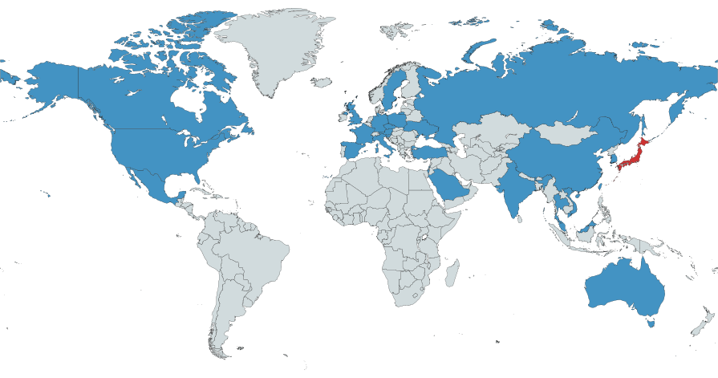

<!-- backgroundImage: -->

# **Next generation detector operations with augmented reality**

**Lorenz Gärtner** (LMU) on behalf of
**Thomas Kuhr** (LMU), **Stephan Paul** (TUM), 
**Hans-Günther Moser** (MPP), **Jochen Kuhn** (LMU),
**Christian Ailg** (VR-Lab)

---
<!-- backgroundImage: url('LMU_Logo_RGB_InvertiertSchwarz.png') -->

# How to get things fixed?

Does it move?
- Yes &rarr; send to expert
- No  &rarr; get expert

<!--  -->

---

# For software
 
 
 
 
 
 
 
 
 

## + remotes

<!--  -->

---

# ... or just screen-share
 
 
 
 
 
 
 
 
 
 
 
 
 

---

<h1 style="color:white; font-size:70px;" >
    

        What if we want to fix this?
    

</h1>
 
 
 
 

---

 
 
 
 
 
 
 
 

# 28 countries involved

---

# So far ...

- Bring experts to site &mdash; **high cost**
- Communication with experts via text / audio &mdash; **low quality**

---
# AR approach

Enhance quality of communication with off-site experts

---

# Benefits

- Live audio-visual communication
- Hands-free work for on-site worker
- Experts can point/ draw

:heavy_plus_sign: Efficiency
:heavy_plus_sign: Speed
:heavy_plus_sign: Fewer errors

<!--  -->
<!--  -->

---

<h1 style="color:white; font-size:70px">
    

        Fermilab &mdash; CERN
         
        A successful use case
    

</h1>
 

---

# Cost

- Trimble XR10 with HoloLens 2
- Experts on-site
  - large travel cost
  - massive environmental impact
  - very time consuming

---

# Scalability

If technology meets the needs for remote assistance...

- AR technology is readily available.
- CERN experiments can directly benefit from Belle II test case.

---

<!-- color: white -->

# Summary

- Remote repairs using AR
- Already widely used in science & industry
- Potential for massive reduction in cost and environmental impact

:white_check_mark: More efficient and reliable detector operation
:white_check_mark: Improved data in particle physics

---

<!-- color:  -->

# Budget plan

| Total budget needs            |               |
| :---------------------------- | ------------: |
| Trimble XR10 with HoloLens2   | 5400€         |
| Student assistan (9 months)   | 4500€         |
| Software liscences            | 800€          | 
| **Total**                     | **10700€**    |

